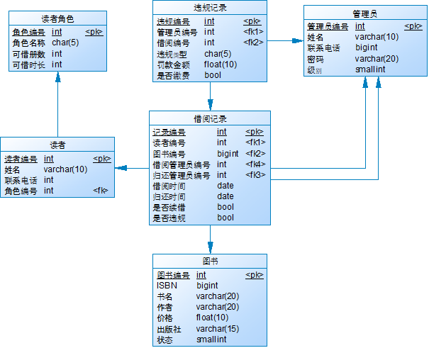

#  《图书馆管理系统》实验报告

| 学号     | 姓名 | 完成时间   |
| -------- | ---- | ---------- |
| 21311003 | 胡城 | 2024.01.26 |

## 一、项目简介

在本学期第9-10次实验课时，我们基本完成了《图书馆管理系统》 的概念设计、逻辑结构设计与物理结构设计。 而现在为了将这套系统开发完全，我们不仅需要完成数据库方面的实现，我们还需要为其实现一个图形化的界面方便用户使用。

所以，在整个开发流程中，我们首先进行原型设计，为了系统以用户使用的角度设计一套合适的GUI与交互逻辑，此后，再以该原型设计优化和改进之前的数据库设计，最后我们根据前面的设计成果，开发整套系统。

## 二、原型设计

目前最出名的原型设计工具是Figma，但先前也用过几次，就想尝试些其他的原型设计工具。在本次实验中，我使用了万兴科技旗下的墨刀进行原型设计。在参考了一些其他管理的系统的网页，并结合了本系统的业务逻辑，我们以WebUI为框架，开发了以下登陆页面和主要的功能页面。

由于篇幅有限，以下仅展示登录页面与图书借还页面的原型设计。


## 三、数据库设计

经过上述的原型设计，我们对先前实验课的数据库设计进行了适当优化与调整。以下数据库图表是由Power Designer由设计生成的，整体设计基本与显示实验课内容相同，以下我重点阐述在设计过程中的一些思考。



在原来的核心业务中包括超期罚款和图书丢失两个部分，但通过对比可知，这两种业务类型虽然名称不同，但是都涉及到借阅记录，以及罚款金额，所以我将这两部分业务合并在一起，并使用违规类型进行区分，这样就能提高代码的复用性，减少冗余了。

初次之外，为了更贴合实际场景的使用，我们为管理员表引入级别属性，其包括以下三种类型的级别。通过这样分层管理的思想，使系统设计更加科学。

| 级别       | 权限                           | 备注                 |
| ---------- | ------------------------------ | -------------------- |
| 根管理员   | 管理超级管理员                 | 当数据库初始化时创建 |
| 超级管理员 | 管理普通管理员，管理书籍和读者 |                      |
| 普通管理员 | 管理图书借还                   |                      |

在后面进行的系统开发时，我发现在图书表中图书编号与ISBN号不符合第三范式，其中图书状态和ISBN依赖于图书编号，而书名、作者等信息依赖于ISBN，此时出现了传递依赖。这种问题仅当同一ISBN的图书导入多本时才会发生。由于时间关系，我仅指出该问题但不予解决。

### 四、系统开发

为了将上述设计成果实现，我以前后端分离的范式进行开发对应Web程序，技术栈的选择如下所示。 前端主要是使用Vue3框架，而后端则选择Java的Spring套件。

* 前端：Vue3，Element，Axios
* 后端：SpringBoot，MyBatis，MySQL

### 1. 后端开发

在后端开发中，整体的项目结构是按照由Spring MVC，Spring和MyBatis组成的SSM框架开发的，其中SSM框架就是一种标准的MVC设计模式，其主要三层部分。其中在持久层中与我们《数据库系统原理》这门课程联系最为紧密。

1. 持久层 DAO：负责与数据库进行联络与交互
2. 业务层 Service：对业务代码进行封装
3. 表现层 Controller：对前端暴露API

具体而言，对于我们系统中的一个管理员登录接口，DAO层负责从数据库中查找管理员的正确密码，Service层则判断输入密码与正确密码是否相同，而Controller层则接收前端发送的数据，验证格式并返回结果。通过这样的分层设计，每一层中的代码能够降低耦合性，便于后续程序的开发和拓展。

---

由于持久层开发与本课程联系十分紧密，所以在此展开谈谈我使用MyBatis的感受。

MyBatis是基于JDBC封装的一个持久层框架，它相比于JDBC，能省去很多部署和配置的时间，比如数据库连接和连接池的构建。此外，它引入动态SQL语句的机制，能够十分方便地编写和维护SQL代码。最后，在该框架下的SQL代码是通过XML文件与DAO层进行绑定，大大减少了Java代码与SQL语句的耦合度。

正如以下，我需要为持久层编写一个条件查询读者信息的功能。

```java
List<Reader> query(Reader reader, Integer pageNum, Integer pageSize);
```

那么我只需要在对应的XML文件中编写其相关的SQL语句即可，其中该XML文件是通过id属性与函数名相互绑定。该文件内的SQL语句实际上和正常的SQL语法并无二异，但是where部分经过了特殊的处理。因为在实际的查询过程中，可能并不会用到读者信息的所有条件进行筛选，但如果在where中列出所有属性的条件，当对应属性为空时，则会影响到最终的查询结果。

所以MyBatis引入了动态SQL语句的机制，当输入的对应属性为空时，则不会再生成条件语句，因此能够保证在使用同一条SQL语句的情况下，完成多种条件的查询。

```xml
<select id="query" resultMap="readerMap">
   select reader.id, reader.name, reader.phone, role.id as rid, role.name as rname
   from reader, reader_role as role
   <where>
     reader.role_id = role.id
     <if test="reader.id!=null">and reader.id = #{reader.id}</if>
     <if test="reader.name!=null">and reader.name like CONCAT('%',#{reader.name},'%')</if>
     <if test="reader.phone!=null">and phone like CONCAT('%',#{reader.phone},'%')</if>
     <if test="reader.role.id!=null">and role_id=#{reader.role.id}</if>
   </where>
   order by reader.id
   limit #{pageNum}, #{pageSize}
 </select>
```

### 2. 前端开发

由于篇幅有限，我主要介绍本系统中的三个界面。

#### (1) 管理员登录

在管理员登录页面，需要输入管理员的工号（管理员编号）和密码，当账号不存在，或者密码输入错误时，系统则会提示“账号或者密码输入错误”。当然，如果输入正确，系统则会跳转到主要的功能页面。


#### (2) 读者身份管理

该页面提供了读者身份的表格查看、添加、修改和删除操作。值得注意的是，读者身份的编号是由系统自动生成的，所以在添加和修改时不需要设置，也不能修改。


在修改读者角色时，初始情况下时不能修改的，只能点击编辑后才能进行修改，此后再点击保存，修改后的数据才能持久化地保存在数据库中。你也可以随时点击取消结束当前操作。


#### (3) 读者管理

在读者页面中，我们提供了丰富的查询和筛选功能。不仅可以使用编号准确查询，还可以使用姓名和电话模糊查询，此外还可以根据读者角色来对查询结果进行筛选。由于一个图书馆内的读者数量可能十分庞大，所以为此我们还实现了表格展示的分页功能， 通过分页的方式，方便用户查看数据。


